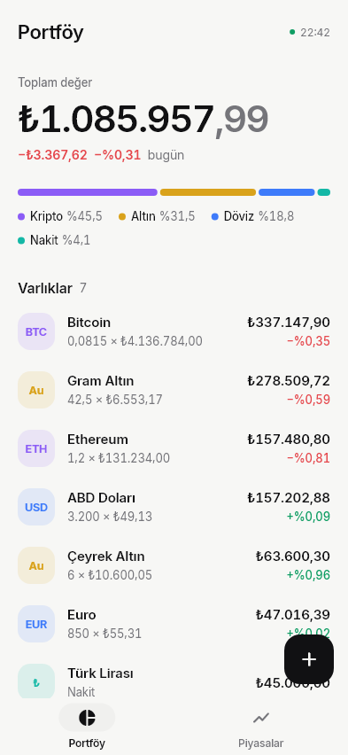
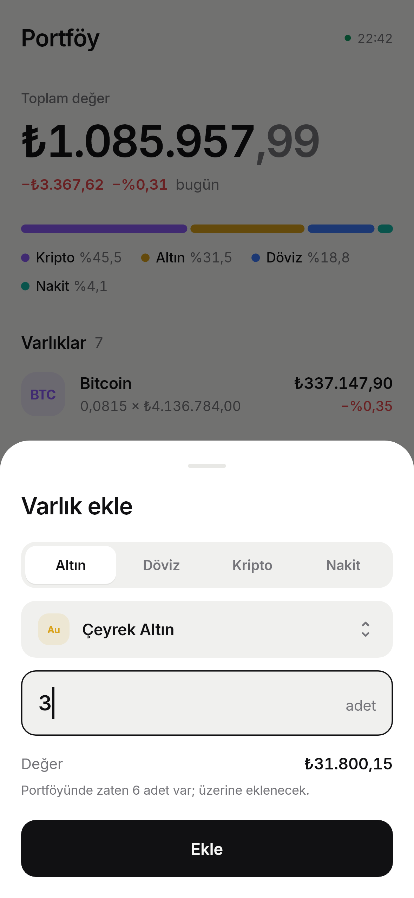
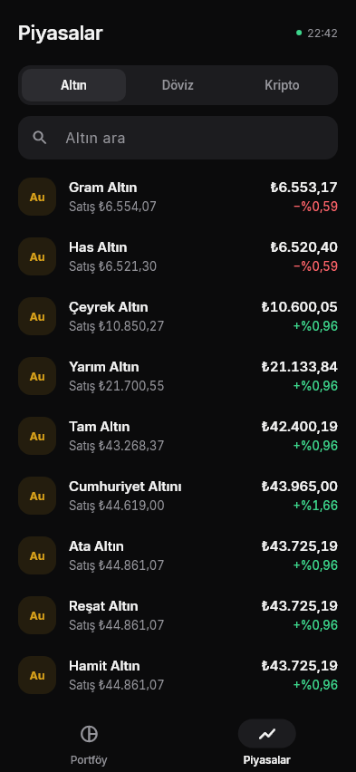
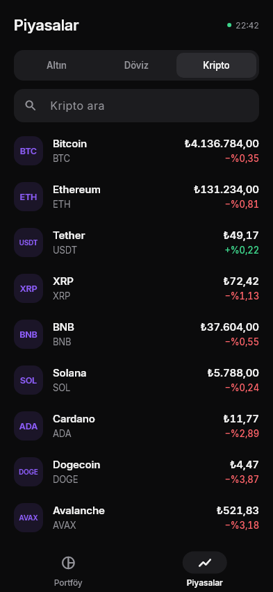

# Kese

**Net varlık takibi.** Altın, döviz, kripto, nakit ve borçlarınızın toplam TL değerini canlı fiyatlarla gösteren sade bir Flutter uygulaması.

<p>
  
  
  
  
</p>

## Özellikler

- **Portföy özeti:** Toplam değer, bugünkü kâr/zarar ve varlık türlerine göre dağılım.
- **Varlık ekleme:** Altın (gram/adet), döviz, kripto ya da nakit TL ekleyebilir, eklemeden önce TL karşılığını görebilirsiniz.
- **Düzenleme ve silme:** Bir varlığa dokunarak miktarını değiştirebilir, sola kaydırarak silebilir, "Geri al" ile silmeyi geri alabilirsiniz.
- **Piyasalar:** Altın, döviz ve kripto fiyatlarını günlük değişimleriyle listeler. Türkçe karakter duyarsız arama destekler ("ceyrek" yazınca Çeyrek Altın bulunur).
- **Güncel fiyatlar:** Fiyatlar dakikada bir ve uygulamaya her dönüşte otomatik yenilenir; bir kaynak yanıt vermezse 15 saniye sonra yeniden denenir.
- **Çevrimdışı çalışma:** Son alınan fiyatlar cihazda saklanır. Bağlantı yoksa bu fiyatlar gösterilir ve ekranda uyarı belirir.
- **Açık / koyu tema:** Sistem temasını izler.

## Teknik yapı

| Katman | İçerik |
| --- | --- |
| `lib/data` | Modeller, fiyat API'leri ve ayrıştırıcılar, portföy ve fiyat depoları, 2.x verilerinin taşınması |
| `lib/state` | Riverpod provider'ları: piyasa, portföy, portföy özeti |
| `lib/features` | Ekranlar: portföy, piyasalar, varlık ekleme/düzenleme |
| `lib/widgets`, `lib/core` | Ortak bileşenler, tema, biçimlendirme |

- **Flutter 3.29+ / Dart 3.7+**
- **flutter_riverpod:** durum yönetimi
- **shared_preferences:** cihazda saklama
- **http, intl:** ağ istekleri ve Türkçe sayı biçimi
- **Inter** yazı tipi uygulamaya gömülüdür (SIL OFL 1.1)

## Kurulum

```bash
git clone https://github.com/Hasanoruc466/wealth_tracker.git
cd wealth_tracker/wealth_tracker
flutter pub get
flutter run
```

Testler:

```bash
flutter test
```

## Veri kaynakları

- **Altın ve gümüş:** Ons fiyatından hesaplanır. Formül: `ons (USD) × USD/TRY ÷ 31,1035 × saf gram × (1 + marj)`. Ons fiyatı [gold-api.com](https://api.gold-api.com/price/XAU)'dan, yedek olarak Binance PAXG'den alınır. Sikke gramajları ve kuyumcu alış/satış marjları [`lib/data/gold_pricing.dart`](wealth_tracker/lib/data/gold_pricing.dart) dosyasındadır; Kapalıçarşı ve Harem Altın fiyatlarına göre ayarlanmıştır.
- **Döviz:** [Truncgil v4](https://finans.truncgil.com/v4/today.json), dakikada bir güncellenir. Altın ve gümüşün günlük değişimi de buradan alınır.
- **Kripto:** [Binance](https://api.binance.com/api/v3/ticker/24hr) TRY pariteleri. Binance'e ulaşılamazsa [Bitlo](https://api4.bitlo.com/market/ticker/all) kullanılır.

Kaynakların hiçbiri API anahtarı gerektirmez.

Varlıklar, piyasanın **alış** fiyatıyla değerlenir; yani bugün bozdursanız elinize geçecek tutar gösterilir.

> 2.x sürümünden güncelleyenlerin kayıtlı varlıkları ilk açılışta otomatik olarak yeni biçime taşınır.
